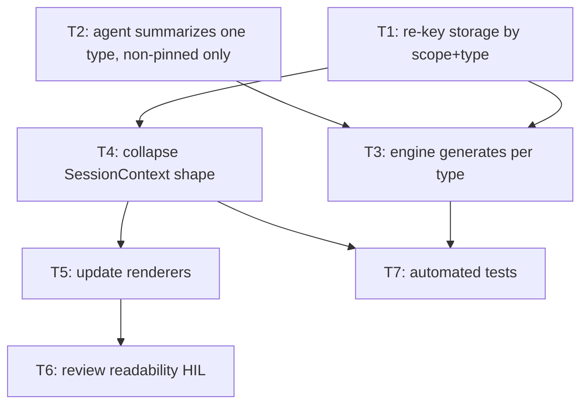

# Bullet 01 — Per-MemoryType synthesis end-to-end

**Goal:** A scope's session context is built from one synthesis per non-empty MemoryType (excluding pinned memories), shown alongside a verbatim pinned section, ordered pinned-first then by MemoryType precedence — replacing the single per-scope blob and the synthesis-vs-pinned mode switch.

**Serves these PRD items:**

- US-1: "As a user with many stored memories, I want each kind of memory summarized separately so that detail from smaller kinds isn't drowned out by larger ones."
- US-2: "As a user who pins important memories, I want pinned memories shown word-for-word so that nothing I marked as critical is paraphrased or dropped."
- US-4: "As the assistant receiving session context, I want a predictable, ordered structure so that I can reliably locate each kind of memory."
- G-1: "A scope produces up to one Synthesis per MemoryType (maximum 5 per scope) instead of a single combined blob."
- G-2: "No PinnedMemory content ever appears inside any Synthesis output; pinned memories appear verbatim in a dedicated SessionContext section in 100% of injections where pinned memories exist."
- G-4: "Every SessionContext injection contains the pinned section and the per-MemoryType content together; the prior either/or behavior is removed."
- G-5: "Sections appear in a fixed order: the pinned section first, then MemoryType groups in precedence order — correction > preference > decision > learning > fact."

## Tasks

Each line: `**{id}** [AFK|HIL] {description} — serves: {PRD refs} — depends: {task ids, or —}`

- [ ] **T1** [AFK] Re-key the synthesis storage model by (scope, MemoryType) instead of scope alone — covering reads, writes, in-flight tracking, versioning, and dirty/expiry detection — so each scope can hold up to one synthesis per type. — serves: G-1 — depends: —
- [ ] **T2** [AFK] Make the synthesis agent summarize the memories of a single MemoryType within a scope, taking only non-pinned memories as input so pinned content can never enter a synthesis. — serves: US-1, G-2 — depends: —
- [ ] **T3** [AFK] Update the synthesis engine/run path to generate one synthesis per non-empty MemoryType in a dirty scope. — serves: US-1, G-1 — depends: T1, T2
- [ ] **T4** [AFK] Replace the SessionContext shape with a single structure: a verbatim pinned section (global + project) plus per-MemoryType synthesis entries, ordered pinned-first then by MemoryType precedence; remove the synthesis/pinned mode switch. — serves: US-2, US-4, G-2, G-4, G-5 — depends: T1
- [ ] **T5** [AFK] Update every SessionContext consumer/renderer in the presentation packages to display the pinned section and the per-MemoryType sections. — serves: G-4 — depends: T4
- [ ] **T6** [HIL] Review the rendered session context for readability and correct ordering. — serves: US-4, G-5 — depends: T5
- [ ] **T7** [AFK] Add/extend automated tests for per-type storage, per-type generation, pinned exclusion, deterministic ordering, and the assembled SessionContext. — serves: G-1, G-2, G-5 — depends: T3, T4

## Dependency tree

Tasks at the same depth with no edge between them run in parallel.

## Human-in-the-loop callouts

- **T6** — A human must look at the assembled session context and judge whether the multi-section layout (pinned section + per-type syntheses) reads clearly and the ordering feels right. This is irreducible **judgment/taste**: ordering correctness is asserted by tests (T7), but whether the rendered result is genuinely readable is subjective and cannot be designed away.

## Done when

Requesting a scope's session context returns a single bundle containing a verbatim pinned section followed by one synthesis per non-empty MemoryType in precedence order, no pinned content appears inside any synthesis, and the old synthesis-vs-pinned mode switch is gone — demonstrated live in at least one presentation package and covered by automated tests.
