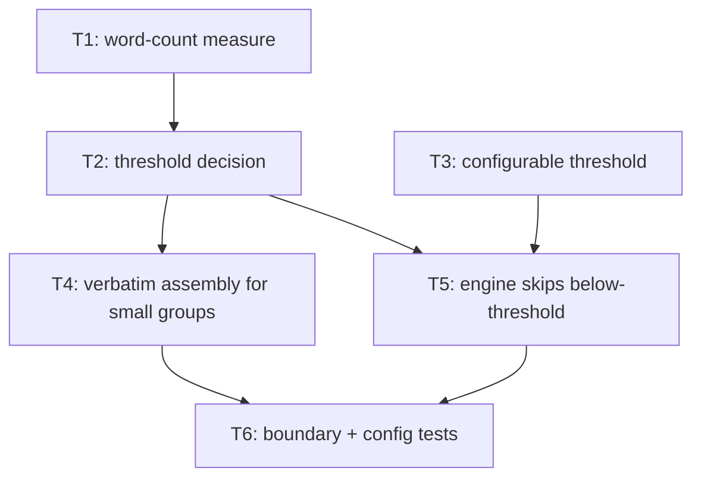

# Bullet 02 — Threshold-gated verbatim fallback

**Goal:** A MemoryType group whose non-pinned memories total below a configurable word-count SynthesisThreshold (default 150) is injected verbatim instead of summarized; at or above the threshold it is synthesized. The decision is deterministic for a given memory set.

**Serves these PRD items:**

- US-3: "As a user with only a few memories of a given kind, I want those shown verbatim so that small groups aren't needlessly summarized."
- G-3: "A MemoryType group whose non-pinned memories total below the SynthesisThreshold (default 150 words, user-configurable) is injected verbatim; a group at or above the threshold is synthesized. The decision is deterministic and verifiable for a given memory set."

## Tasks

Each line: `**{id}** [AFK|HIL] {description} — serves: {PRD refs} — depends: {task ids, or —}`

- [ ] **T1** [AFK] Add a deterministic word-count measurement of the non-pinned memories in a single (scope, MemoryType) group. — serves: G-3 — depends: —
- [ ] **T2** [AFK] Add the threshold decision: a group whose word count is at or above the SynthesisThreshold is synthesized; below it is marked for verbatim injection. — serves: US-3, G-3 — depends: T1
- [ ] **T3** [AFK] Add a configurable SynthesisThreshold (default 150 words) to runtime config and wire it into the decision. — serves: G-3 — depends: —
- [ ] **T4** [AFK] Update SessionContext assembly so below-threshold MemoryType groups inject their non-pinned memories verbatim in place of a synthesis. — serves: US-3, G-3 — depends: T2
- [ ] **T5** [AFK] Update the synthesis engine so it only generates a synthesis for above-threshold groups. — serves: G-3 — depends: T2, T3
- [ ] **T6** [AFK] Add tests for the threshold boundary (just below / just at / just above) and for a non-default configured threshold. — serves: G-3 — depends: T4, T5

## Dependency tree

Tasks at the same depth with no edge between them run in parallel.

## Human-in-the-loop callouts

None — every task is deterministic logic, config, or automated tests.

## Done when

A scope with a small MemoryType group (under the threshold) injects that group's non-pinned memories verbatim, a scope with a large group injects a synthesis for it, the boundary is exercised by tests, and changing the configured SynthesisThreshold demonstrably moves a group between the verbatim and synthesized paths.
