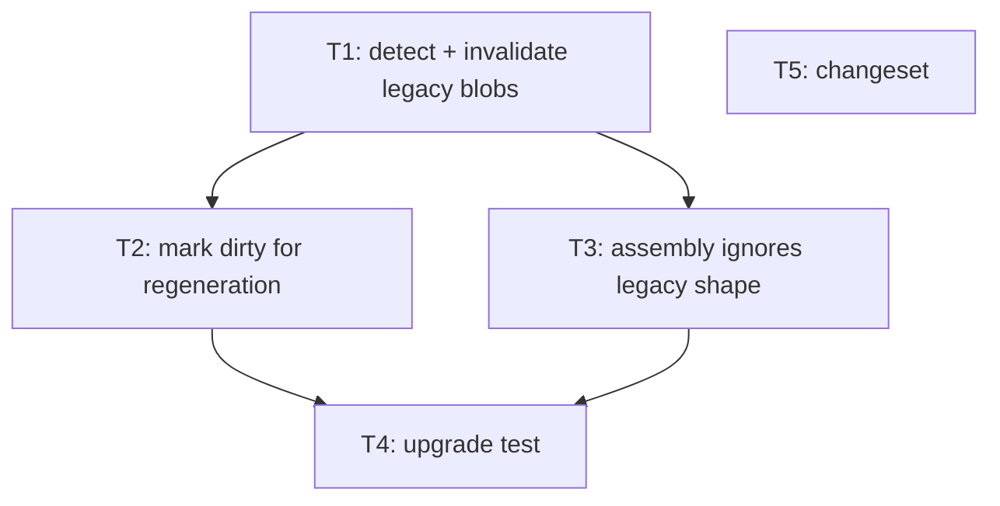

# Bullet 03 — Legacy synthesis invalidation on upgrade

**Goal:** After upgrading to the per-MemoryType model, any pre-existing single-blob (per-scope) synthesis is invalidated and never injected again; affected scopes regenerate in per-MemoryType form on their next synthesis cycle.

**Serves these PRD items:**

- US-5: "As a user upgrading the system, I want stale combined syntheses replaced automatically so that I never see an outdated summary format."
- G-6: "On upgrade, every pre-existing single-blob synthesis is invalidated and is never injected again; each scope regenerates in the per-MemoryType form on its next synthesis cycle."

## Tasks

Each line: `**{id}** [AFK|HIL] {description} — serves: {PRD refs} — depends: {task ids, or —}`

- [ ] **T1** [AFK] On upgrade, detect pre-existing single-blob (per-scope) syntheses and invalidate them so they are never injected. — serves: US-5, G-6 — depends: —
- [ ] **T2** [AFK] Mark invalidated scopes dirty so the engine regenerates them in per-MemoryType form on the next cycle. — serves: G-6 — depends: T1
- [ ] **T3** [AFK] Ensure SessionContext assembly never injects a legacy single-blob synthesis (legacy shape is ignored if encountered). — serves: US-5, G-6 — depends: T1
- [ ] **T4** [AFK] Add an upgrade test: legacy single-blob data present → invalidated → not injected → regenerated per type. — serves: G-6 — depends: T2, T3
- [ ] **T5** [AFK] Add a changeset describing the per-MemoryType synthesis feature and verbatim pinned section. — serves: US-5 — depends: —

## Dependency tree

Tasks at the same depth with no edge between them run in parallel.

## Human-in-the-loop callouts

None — invalidation targets regenerable derived synthesis data, not user-authored memories, so it is reversible (it regenerates) and not high-blast-radius. All tasks are AFK.

## Done when

Starting the system against a database that holds an old single-blob synthesis shows no legacy blob in any session injection, the affected scopes regenerate as per-MemoryType syntheses on the next cycle, an automated upgrade test proves this transition, and a changeset is staged.
